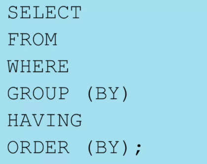

# Week 2

## Queries

> Query:
SQL code that describes the data you desire and the format in which you want it

* All queries start with a verb SELECT followed by clauses that identify the data and the database you want to work with and the format.



* SELECT and from and required
* You must end your queries with ;

## Syntax

* Recommended syntax is to write each keyword along with the caracthers that follow them in each line as :


## Other Keywords/Commands

* SHOW

Examples:
```SQL
SHOW tables
SHOW columns FROM $table$
SHOW columns FROM $table$ FROM $database$
SHOW columns FROM $databasename.tablename$
```

* DESCRIBE

> Gets a detailed description of the table

<table>
    <tbody>
        <tr>
            <th>Field</th>
            <th>Type</th>
            <th>Null</th>
            <th>Key</th>
            <th>Default</th>
            <th>Extra</th>
        </tr>
        <tr>
            <td>created_at</td>
            <td>datetime</td>
            <td>NO</td>
            <td></td>
            <td>None</td>
            <td></td>
        </tr>
        <tr>
            <td>updated_at</td>
            <td>datetime</td>
            <td>NO</td>
            <td></td>
            <td>None</td>
            <td></td>
        </tr>
        <tr>
            <td>user_guid</td>
            <td>varchar(60)</td>
            <td>YES</td>
            <td>MUL</td>
            <td>None</td>
            <td></td>
        </tr>
        <tr>
            <td>dog_guid</td>
            <td>varchar(60)</td>
            <td>YES</td>
            <td>MUL</td>
            <td>None</td>
            <td></td>
        </tr>
        <tr>
            <td>test_name</td>
            <td>varchar(60)</td>
            <td>YES</td>
            <td></td>
            <td>None</td>
            <td></td>
        </tr>
        <tr>
            <td>subcategory_name</td>
            <td>varchar(60)</td>
            <td>YES</td>
            <td></td>
            <td>None</td>
            <td></td>
        </tr>
    </tbody>
</table>

* SQL syntax and keywords are case insensitive. I recommend that you always enter SQL keywords in upper case and table or column names in either lower case or their native format to make it easy to read and troubleshoot your code, but it is not a requirement to do so. Table or column names are often case insensitive as well, but defaults may vary across database platforms so it's always a good idea to check.
* Table or column names with spaces in them need to be surrounded by quotation marks in SQL. MySQL accepts both double and single quotation marks, but some database systems only accept single quotation marks. In all database systems, if a table or column name contains an SQL keyword, the name must be enclosed in backticks instead of quotation marks.

>    'the marks that surrounds this phrase are single quotation marks'
    "the marks that surrounds this phrase are double quotation marks"
    \`the marks that surround this phrase are backticks\`


* The semi-colon at the end of a query is only required when you have multiple separate queries saved in the same text file or editor. That said, I recommend that you make it a habit to always include a semi-colon at the end of your queries. 

* LIMIT

Limitates the number of rows selected

* OFFSET

Give a offset to the SELECT clause

```SQL
SELECT breed
FROM dogs LIMIT 10 OFFSET 5;
```

or you could just do:

```SQL
SELECT breed
FROM dogs LIMIT 5,10;
```
## SQL function and operators

https://dev.mysql.com/doc/refman/5.7/en/sql-function-reference.html

https://www.w3resource.com/mysql/mysql-functions-and-operators.php

* IN operator

Lets you select more than one string value

```SQL
SELECT dog_guid, breed
FROM dogs
WHERE breed IN ("golden retriever","poodle");
```

* LIKE operator

The LIKE operator allows you to specify a pattern that the textual data you query has to match. For example, if you wanted to look at all the data from breeds whose names started with "s", you could query:

```SQL
SELECT dog_guid, breed
FROM dogs
WHERE breed LIKE ("s%");
```

In this syntax, the percent sign indicates a wild card. Wild cards represent unlimited numbers of missing letters. This is how the placement of the percent sign would affect the results of the query:

* WHERE breed LIKE ("s%") = the breed must start with "s", but can have any number of letters after the "s"
* WHERE breed LIKE ("%s") = the breed must end with "s", but can have any number of letters before the "s"
* WHERE breed LIKE ("%s%") = the breed must contain an "s" somewhere in its name, but can have any number of letters before or after the "s"

## Time 

https://www.tutorialspoint.com/mysql/mysql-date-time-functions.htm

* AS

The AS clause allows you to assign an alias (a temporary name) to a table or a column in a table. Aliases can be useful for increasing the readability of queries, for abbreviating long names, and for changing column titles in query outputs. 

```SQL
SELECT dog_guid, created_at AS time_stamp
FROM complete_tests
LIMIT 100;
```
<table>
    <tbody><tr>
        <th>dog_guid</th>
        <th>time_stamp</th>
    </tr>
    <tr>
        <td>fd27b86c-7144-11e5-ba71-058fbc01cf0b</td>
        <td>2013-02-05 18:26:54</td>
    </tr>
    <tr>
        <td>fd27b86c-7144-11e5-ba71-058fbc01cf0b</td>
        <td>2013-02-05 18:31:03</td>
    </tr>
    <tr>
        <td>fd27b86c-7144-11e5-ba71-058fbc01cf0b</td>
        <td>2013-02-05 18:32:04</td>
    </tr>
    <tr>
        <td>fd27b86c-7144-11e5-ba71-058fbc01cf0b</td>
        <td>2013-02-05 18:32:25</td>
    </tr>
    <tr>
        <td>fd27b86c-7144-11e5-ba71-058fbc01cf0b</td>
        <td>2013-02-05 18:32:56</td>
    </tr>
</tbody></table>

* DISTINCT
remove duplicate rows

```SQL
SELECT DISTINCT breed
FROM dogs;
```

if you choose more than one column it will take all the combinations between these two columns

* ORDER BY

ORDER BY clause allow you to sort the output according to your own specifications.

> Ascending order

```SQL
SELECT DISTINCT breed
FROM dogs 
ORDER BY breed;
```

> Descending order

```SQL
SELECT DISTINCT breed
FROM dogs 
ORDER BY breed DESC
```

```SQL
SELECT DISTINCT user_guid, state, membership_type
FROM users
WHERE country="US" AND state IS NOT NULL and membership_type IS NOT NULL
ORDER BY membership_type DESC, state ASC
LIMIT 10;
```

> sorts by membershiptype in descending order first thand state by ascending order

<table>
    <tbody><tr>
        <th>user_guid</th>
        <th>state</th>
        <th>membership_type</th>
    </tr>
    <tr>
        <td>ce7f9a2a-7144-11e5-ba71-058fbc01cf0b</td>
        <td>CA</td>
        <td>5</td>
    </tr>
    <tr>
        <td>ce80ec72-7144-11e5-ba71-058fbc01cf0b</td>
        <td>CA</td>
        <td>5</td>
    </tr>
    <tr>
        <td>ce88fa84-7144-11e5-ba71-058fbc01cf0b</td>
        <td>CA</td>
        <td>5</td>
    </tr>
    <tr>
        <td>ce815e0a-7144-11e5-ba71-058fbc01cf0b</td>
        <td>CO</td>
        <td>5</td>
    </tr>
    <tr>
        <td>ce802602-7144-11e5-ba71-058fbc01cf0b</td>
        <td>CT</td>
        <td>5</td>
    </tr>
    <tr>
        <td>ce7ff100-7144-11e5-ba71-058fbc01cf0b</td>
        <td>FL</td>
        <td>5</td>
    </tr>
    <tr>
        <td>ce803a0c-7144-11e5-ba71-058fbc01cf0b</td>
        <td>FL</td>
        <td>5</td>
    </tr>
    <tr>
        <td>ce804394-7144-11e5-ba71-058fbc01cf0b</td>
        <td>FL</td>
        <td>5</td>
    </tr>
    <tr>
        <td>ce8756ac-7144-11e5-ba71-058fbc01cf0b</td>
        <td>FL</td>
        <td>5</td>
    </tr>
    <tr>
        <td>ce80c184-7144-11e5-ba71-058fbc01cf0b</td>
        <td>IN</td>
        <td>5</td>
    </tr>
</tbody></table>

## Exporting queries

* To put the results of a query inside a variable:

```SQL
variable_name_of_your_choice = %sql [your full query goes here];
```

Example:

```sql
breed_list = %sql SELECT DISTINCT breed FROM dogs ORDER BY breed;
```

to export:

```python
breed_list.to_csv(f"{name}.csv")
```

* REPLACE

"REPLACE(str,from_str,to_str)
Returns the string str with all occurrences of the string from_str replaced by the string to_str. REPLACE() performs a case-sensitive match when searching for from_str."

```SQL
SELECT DISTINCT breed,
REPLACE(breed,'-','') AS breed_fixed
FROM dogs
ORDER BY breed_fixed;
```

* TRIM

https://www.w3resource.com/mysql/string-functions/mysql-trim-function.php